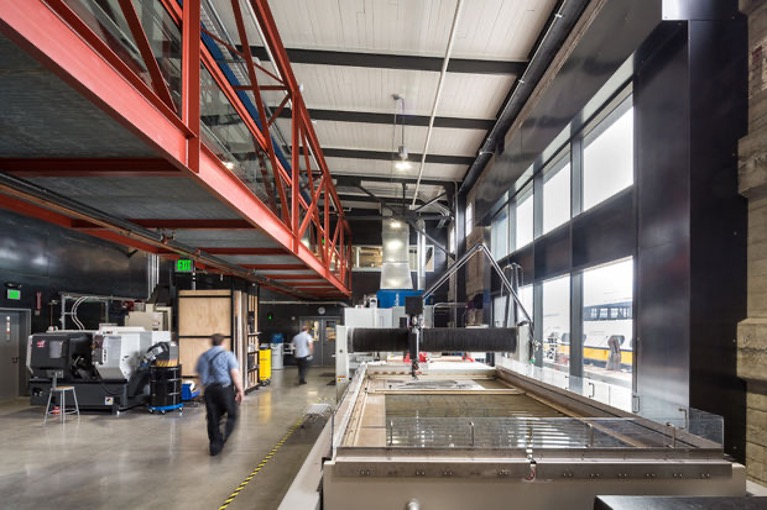
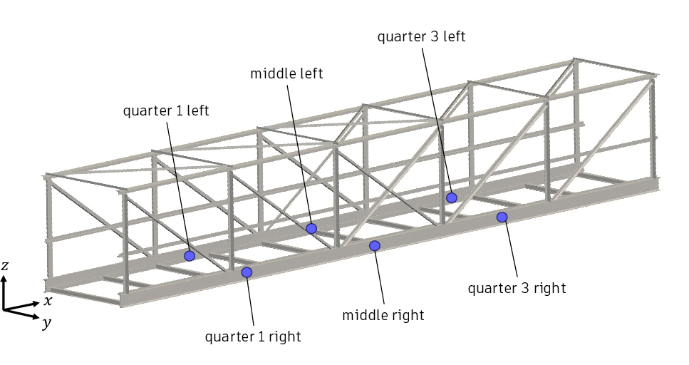

# Pier-9-data-CMAME2025
This repository contains the raw and preprocessed strain gauge data used for the results in the paper "[Probabilistic Learning from Real-World Observations of Systems with Unknown Inputs for Model-Form UQ and Digital Twinning](https://papers.ssrn.com/sol3/papers.cfm?abstract_id=4960520)" submitted to the journal of Computer Methods in Applied Mechanics and Engineering.

Materials distributed in this repository are copyright Autodesk, Inc. [CC BY-NC 4.0](https://creativecommons.org/licenses/by-nc/4.0/).

The directories "2019_04_24_150000UTC", "2019_04_24_150000UTC", and "2019_04_24_150000UTC" contain the time series strain gauge data gathered respectively on April 24th, 25th, and 26th, 2019 from an indoor steeltruss bridge in the Autodesk office at Pier 9, San Francisco. 

The content within each directory is organized by the names of the 6 sensors, the locations of which are indicated in the figure below:

There are 3 zip files for each sensor on each day: 
+ **Data_Raw.csv.zip** contains the raw data measured by the sensor at 80Hz. The two columns in the csv file contain the strain measurement and the UTC timestamp for when the measurement was recorded.
+ **Data_Cleaned.csv.zip** contains the time series strain data after it has been digitally filtered (so that it is roughly at zero when the bridge is at rest, with unwanted trends and high-frequency noise removed). The "time" column indicates the timestamp in terms of _seconds_ and is measured from the first timestamp in the raw data of the same day. The first _1 sec_ is removed due to aliasing effect produced by the digital filtering.
+ **Data_Cleaned_Spikes_Removed.csv.zip** contains the result of applying an algorithm to automatically detect and remove unwanted artifacts in the cleaned data due to unknown interference. Please refer to Section 7.1 of the manuscript for additional details regarding the data collection and preprocessing steps.

The "DTI Training Data" directory contains the time series strain data for 233 events (or instances of a single person walking across the bridge without interruption), as well as the load parameters identified using Algorithm 1 in the manuscript. These are the training data used to update the digital twin instance (DTI) of the bridge (see Section 7.5 of manuscript). The following files can be found in the "DTI Training Data" directory:
+ **FEA_data.npz.zip** contains the basic datastructure from a beam network finite element model of the bridge, including: stiffness matrix (_K_), the mass matrix (_M_), the measurement matrix (_H_) mapping from the global displacement vector to the measured strain at the sensor locations, global degrees-of-freedom index for the Dirichlet boundary conditions (_BC_), and the mesh coordinates (_mesh_).
+ **mesh.vtu** contains the finite element mesh of the beam network model.
+ **mu_list.csv** contains a list of identified load parameters for each of the 228 events. For a detailed description of the parameters, please refer to Section 7.4 in the manuscript.
+ **Sensor_data.zip** contains the time series strain data for each event in _mu_list.csv_. The directory for each event is named by concatenating the parameter values in columns 3 to 14 of _mu_list.csv_ to 4 decimal places. Each directory contains the time series strain data for each sensor. The timestamp for each strain reading is in seconds, measured from the start of an approximate time window during which the event occurred. The precise start time of the event (see Figure 14 of manuscript) is indicated in column 2 of _mu_list.csv_.